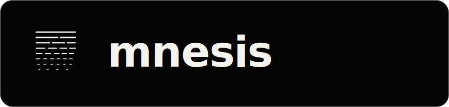

<p align="center">
  
</p>

<p align="center">
  <a href="LICENSE"></a>
  <a href="https://github.com/mnesis-app/Mnesis/releases"></a>
  <a href="https://github.com/mnesis-app/Mnesis/actions"></a>
</p>

## Local-first memory infrastructure for multi-LLM workflows

Mnesis is a desktop application (macOS + Windows) that acts as a persistent memory layer across LLM clients.

Use ChatGPT, Claude, Cursor, and other MCP-capable tools with one shared memory base — without re-explaining your projects and preferences in every app.

---

## Download

Grab the latest release for your platform on the [**Releases page**](https://github.com/mnesis-app/Mnesis/releases).

> **macOS — first launch:** Binaries are not yet notarized (Apple Developer Program required). macOS will show *"damaged and can't be opened"*. Fix with one command:
> ```bash
> xattr -cr /Applications/Mnesis.app
> ```
> Then launch normally. Alternatively: System Settings → Privacy & Security → **Open Anyway**.
>
> **Windows:** SmartScreen may warn on first launch — click *More info → Run anyway*.

---

## Features

- **Provenance on every write** — each memory records the source LLM, conversation, and message it came from. Nothing is anonymous.
- **Conflict detection and review** — when two clients write contradictory facts, Mnesis surfaces the conflict for human review instead of silently overwriting.
- **Memory lifecycle** — active → pending review → archived → deleted. Memories decay gracefully over time.
- **Native MCP server** — Claude, Cursor, and any MCP-capable client can read and write memories without a proxy or cloud relay.
- **Provider-agnostic** — works with OpenAI, Anthropic, Ollama, or any OpenAI-compatible endpoint.
- **Local-first** — data never leaves your machine unless you configure sync explicitly.
- **Ask (RAG chat)** — conversational interface to search and query your memory base, powered by your chosen LLM.
- **Graph view** — visualize relationships between memories and conversations with KuzuDB.
- **Server mode** — run headless (Docker, systemd, launchd) for NAS or always-on setups.

---

## Why Mnesis?

| | Mnesis | mem0 | Claude Projects | Obsidian |
|---|---|---|---|---|
| Local-first | ✅ | Requires cloud | Requires Anthropic | ✅ |
| Multi-LLM | ✅ | ✅ | Claude only | Manual |
| Provenance tracking | ✅ | ❌ | ❌ | ❌ |
| Conflict detection | ✅ | ❌ | ❌ | ❌ |
| Native MCP | ✅ | Partial | ❌ | ❌ |

---

## Quick start (development)

**Prerequisites:** Node.js 18+, Python 3.11+

```bash
npm install
python3 -m pip install -r requirements.txt
npm run dev
```

This starts:
- **UI** (Vite): `http://127.0.0.1:5173`
- **Backend API** (FastAPI): `http://127.0.0.1:7860`
- **Electron shell**

---

## Server mode (headless)

Mnesis can run as a headless service (Docker, systemd, launchd) without Electron. See the [deployment docs](https://docs.mnesis.app) for instructions.

---

## MCP integration

Add Mnesis as an MCP server in Claude Desktop / Cursor / any MCP client:

```json
{
  "mcpServers": {
    "mnesis": {
      "command": "/path/to/mnesis-mcp-bridge",
      "args": []
    }
  }
}
```

The bridge is a lightweight binary bundled in the release — no separate server to run.

---

## Documentation

Full documentation: [docs.mnesis.app](https://docs.mnesis.app)

---

## Common scripts

| Command | Description |
|---|---|
| `npm run dev` | Full local development stack |
| `npm run test` | Frontend tests (vitest) |
| `npm run test:backend` | Backend pytest suite |
| `npm run check:v1` | Public v1 readiness checks |
| `npm run clean:tmp` | Cleanup temporary workspace artifacts |

---

## Security and networking stance

- Local-first by default — no mandatory cloud relay.
- Online exposure is BYO tunnel, explicitly user-managed.
- MCP and admin surfaces are scope-based and rate-limited.

See [`SECURITY.md`](SECURITY.md) to report vulnerabilities.

---

## Repository structure

```
backend/          Memory core, APIs, scheduler, MCP server
src/              React UI
electron/         Desktop shell and process orchestration
assets/branding/  Brand assets (woodmark, icon variants)
tests/            Backend tests
```

---

## Client compatibility

| Client | Transport | Status | Notes |
|---|---|---|---|
| **Claude Desktop** | stdio | Full support | All 15 MCP tools; auto-configured on install |
| **Cursor** | HTTP | Full support | All MCP tools via HTTP/SSE |
| **Windsurf** | HTTP | Partial | Missing `memory_update` |
| **ChatGPT** | HTTP | Limited | Dev-mode only; chat interface only; 3 tools (`context_snapshot`, `memory_write`, `memory_read`) |
| **Ollama / Open WebUI** | HTTP | Manual | Requires manual MCP configuration |

> **ChatGPT note:** MCP support in ChatGPT is currently in developer preview with limited availability. It only works in the chat interface (not side panels or plugins). Capabilities are restricted to reading and writing memories — no sync, no conflict management, no conversation history.

---

## Known limitations (v0.1)

### Platform

- **macOS** (Apple Silicon) and **Windows** (x64) only. No Intel Mac or Linux desktop packaging yet.
- Binaries are **not code-signed or notarized** in v0.1 — expect Gatekeeper / SmartScreen warnings on first launch.

### First launch

- The embedding model (~100–400 MB) downloads on first startup. This can take **2–5 minutes** on slow connections. A progress bar is shown in the splash screen.
- If ports 7860–7870 are all occupied, the backend cannot start. Close any conflicting process.

### Memory & data

- Memory content: **20–2000 characters** per memory.
- Fixed categories: `identity`, `preferences`, `skills`, `relationships`, `projects`, `history`, `working`. Custom categories are not supported yet.
- Graph visualization may slow down above ~5 000 nodes.
- No bulk export of the full memory base (import-only in v0.1).

### Insights & Ask

- Requires a configured LLM provider (OpenAI, Anthropic, or Ollama) in **Settings → Insights**. Without one, Ask returns retrieved memories but no generated answer.
- Conversation analysis runs asynchronously and depends on LLM quality.

### Sync

- Remote sync (S3, R2, WebDAV) is **opt-in and experimental**. It is designed as one-way encrypted backup, not real-time multi-device sync.
- WebDAV URLs must use HTTPS.

---

## Contributing

See [`CONTRIBUTING.md`](CONTRIBUTING.md) and [`CODE_OF_CONDUCT.md`](CODE_OF_CONDUCT.md).

---

## License

[AGPL-3.0](LICENSE) — open-source, copyleft.
